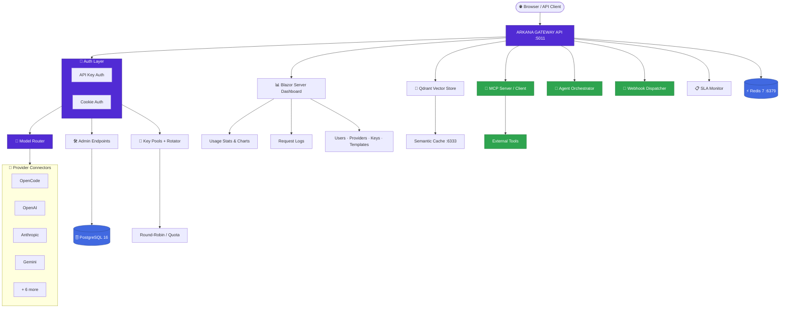
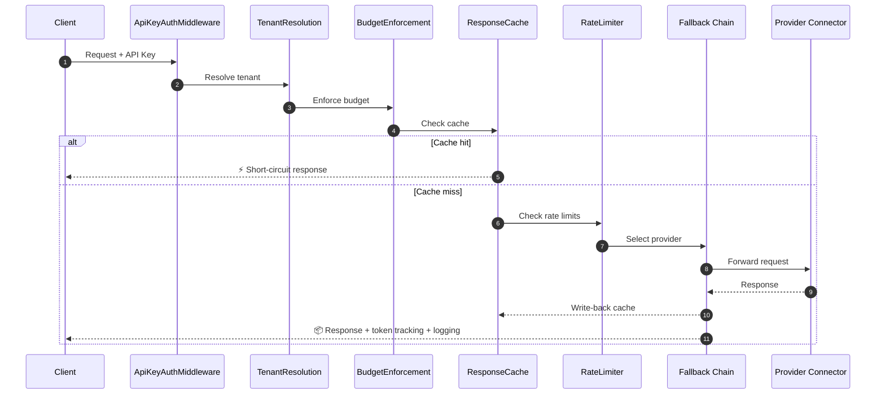
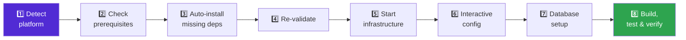
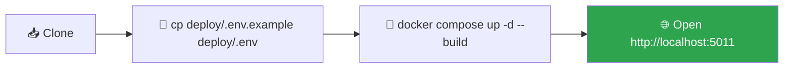
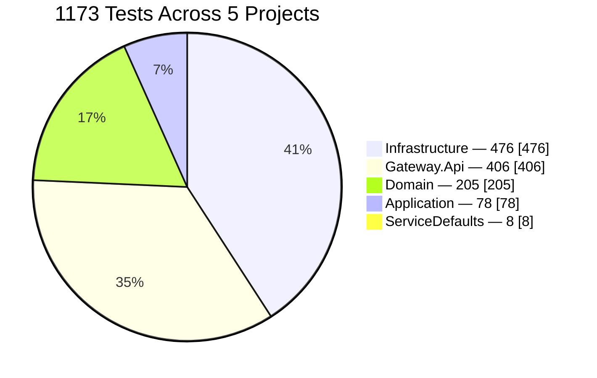

<div align="center">

# 🛰️ ARKANA GATEWAY

### The unified, self-hosted gateway for every AI provider you use

**Route · Secure · Meter · Log · Orchestrate** — one gateway, 10+ providers, zero vendor lock-in.

<br/>

[](#-tech-stack)
[](#dashboard-pages)
[](#-database)
[](#-tech-stack)
[](LICENSE)

[](#-testing)
[](#-development)
[](#-project-structure)
[](#-architecture)
[](#-architecture)

<br/>

**[Quick Start](#-quick-start-docker)** ·
**[Setup Wizard](#-setup-wizard-recommended)** ·
**[Architecture](#-architecture)** ·
**[API Reference](#-api-reference)** ·
**[Troubleshooting](#-troubleshooting-by-platform)**

</div>

---

> [!NOTE]
> **A unified, enterprise-grade AI Gateway** that manages, routes, secures, meters, and logs AI interactions across **10+ providers** — OpenCode Zen, ChatGPT Plus (OAuth account pool `chatgpt-acc1..4`), OpenAI, Anthropic, Gemini, Groq, OpenRouter, Ollama, Cloudflare, Qwen, and GLM — through a real-time Blazor Server dashboard with multi-tenancy, RBAC, key rotation, MCP support, and multi-agent orchestration.

<div align="center">

| 🔑 API Keys | 🔐 Encryption | 🛡️ SSRF Guard | 🔄 Fallback | ⚡ Caching | 🏢 Multi-Tenant | 🤖 Agents |
|:---:|:---:|:---:|:---:|:---:|:---:|:---:|
| Per-model scoped | AES-256-GCM | Outbound validation | 10+ providers | Read/write-through | RBAC + portal | Orchestration |

</div>

---

## 📖 Table of Contents

<details open>
<summary>Click to expand</summary>

- [✨ Features](#-features)
- [🏗️ Architecture](#-architecture)
- [🪄 Setup Wizard (Recommended)](#-setup-wizard-recommended)
- [💻 Prerequisites by Platform](#-prerequisites-by-platform)
- [🚀 Quick Start (Docker)](#-quick-start-docker)
- [🛠️ Native Installation](#-native-installation)
- [⚙️ Configuration](#-configuration)
- [🗄️ Database](#-database)
- [📡 API Reference](#-api-reference)
- [🖥️ Dashboard Pages](#-dashboard-pages)
- [👨‍💻 Development](#-development)
- [✅ Testing](#-testing)
- [🚢 Deployment](#-deployment)
- [🩺 Troubleshooting by Platform](#-troubleshooting-by-platform)
- [📁 Project Structure](#-project-structure)
- [🧰 Tech Stack](#-tech-stack)
- [📜 License](#-license)

</details>

---

## ✨ Features

Grouped by delivery phase — **P1** (foundation) through **P6** (multi-agent orchestration).

<details open>
<summary><b>🧱 P1 — Foundation: Auth, Security & Resilience</b></summary>
<br/>

| Feature | Description |
|---|---|
| 🔑 **API Key Auth** | Secure key-based access with per-model permission control |
| 🔐 **Dashboard Login** | Cookie-auth Blazor dashboard (toggle `AUTH=1`); admin seeded from `ARKANA_ADMIN_*`, role-gated `/settings` & `/admin/users` |
| 🔐 **Envelope Encryption** | Provider credentials encrypted at rest (AES-256-GCM + DEK/KEK) |
| 🛡️ **SSRF Protection** | Outbound URL validation prevents server-side request forgery |
| 🔄 **Fallback Chain** | Automatic failover across providers when upstream fails |
| 🔁 **Retry + Backoff** | Exponential backoff with jitter for transient failures |
| ⏱️ **Account Cooldown** | Per-account rate-limit cooldown to prevent cascading failures |

</details>

<details>
<summary><b>⚡ P2 — Performance: Caching, Rate Limits & Compression</b></summary>
<br/>

| Feature | Description |
|---|---|
| ⚡ **Response Caching** | Read-through + write-back cache with SHA-256 request keying |
| 📦 **Batched Metering** | Async batched token usage recording for dashboard performance |
| 🚦 **Rate Limiting** | Per-key RPM/TPM/concurrency limits, DB-backed configuration |
| 🗜️ **Slimmer Compression** | Input compression strips whitespace/redundancy before upstream |
| 🗜️ **Terse Compression** | Output compression for token-efficient responses |

</details>

<details>
<summary><b>🧠 P3 — Intelligence: Routing, Dialects & Semantic Cache</b></summary>
<br/>

| Feature | Description |
|---|---|
| 🧠 **Multi-Provider Router** | Routes requests via canonical model names → provider connectors |
| 🔄 **Provider Fallback** | Automatic failover across 10+ providers with dialect translation |
| 📐 **Canonical Models** | Abstract model names (`gpt-5.4-mini`) → concrete provider models |
| 🔤 **Anthropic + Gemini** | Full dialect translators for Anthropic and Gemini message formats |
| 🧠 **Semantic Cache** | Qdrant vector store for semantic request caching |
| 📊 **Custom Metrics** | OpenTelemetry metrics (`arkana.*`) for dashboard and alerting |
| 🔢 **Embeddings API** | `/v1/embeddings` endpoint with multi-provider support |

</details>

<details>
<summary><b>🏢 P4 — Enterprise: Multi-Tenancy, RBAC & Compliance</b></summary>
<br/>

| Feature | Description |
|---|---|
| 🏢 **Multi-Tenancy** | Tenant entity with scoping across all resources |
| 📋 **Plans & Budgets** | Plan entity + budget enforcement with reservation pattern |
| 👥 **RBAC + Portal** | Role-based access (Admin/User/Portal), user management, tenant portal |
| 📜 **Compliance Templates** | 5 built-in templates (GDPR, SOC2, HIPAA, DataResidency, Custom) |
| 🔑 **Key Pools + Rotation** | Multi-key pools with round-robin + quota-based automatic rotation |

</details>

<details>
<summary><b>🔌 P5 — Extensibility: MCP, Images & Webhooks</b></summary>
<br/>

| Feature | Description |
|---|---|
| 🖼️ **Image Generation** | `/v1/images/generations` endpoint |
| 🔌 **MCP Server** | Model Context Protocol server (JSON-RPC 2.0) for tools/resources |
| 🔌 **MCP Client** | Connects to external MCP servers via HTTP+SSE |
| 📨 **Webhook Dispatcher** | Event-driven webhook delivery with retry and idempotency |

</details>

<details>
<summary><b>🤖 P6 — Orchestration: Multi-Agent & SLA</b></summary>
<br/>

| Feature | Description |
|---|---|
| 🤖 **Agent Orchestration** | Multi-agent framework with task definition, routing, and execution |
| 📋 **SLA Enforcement** | Tier-based SLA monitoring with metric recording |
| 📈 **Usage Reporting** | Per-agent, per-task usage reporting |

</details>

<div align="right">

[⬆ back to top](#-arkana-gateway)

</div>

---

## 🏗️ Architecture



### 🔄 Request Pipeline



<div align="right">

[⬆ back to top](#-arkana-gateway)

</div>

---

## 🪄 Setup Wizard (Recommended)

The fastest way to get ARKANA GATEWAY running on **any platform** — interactive, self-contained, zero guesswork.

```bash
# 1. Clone
git clone https://github.com/hernanda-git/arkana-gateway.git
cd gateway

# 2. Run the setup wizard
./setup.sh                          # Linux / macOS / WSL
# or: .\setup.ps1                   # Windows PowerShell
# or: dotnet run --project tools/Arkana.Setup
```

### What the Wizard Does



| # | Step | What Happens |
|---|------|-------------|
| 1 | **Platform detection** | Detects Ubuntu/Windows/macOS/WSL/Docker — lets you override |
| 2 | **Prerequisite check** | Scans for .NET 10, Docker, PostgreSQL 16, Redis 7 |
| 3 | **Auto-install** | Single `Y/n` prompt installs ALL missing dependencies via `apt` / `brew` / `winget` |
| 4 | **Re-validate** | Re-checks everything, shows final green/red table |
| 5 | **Infrastructure** | Starts Docker Compose (PostgreSQL + Redis + Qdrant) — skipped on native Ubuntu |
| 6 | **Interactive config** | Prompts for DB credentials, API keys, admin account |
| 7 | **Database setup** | Creates database, applies EF Core migrations, seeds data |
| 8 | **Build & verify** | Builds solution, runs the full suite (1173 tests), generates API key, health check |

<details>
<summary>🖥️ <b>Wizard Preview</b> — click to see it in action</summary>

```text
╔══════════════════════════════════════╗
║  █████╗ ██╗ ██████╗  █████╗ ███████╗║
║ ██╔══██╗██║██╔════╝ ██╔══██╗██╔════╝║
║ ███████║██║██║  ███╗███████║█████╗  ║
║ ██╔══██║██║██║   ██║██╔══██║██╔══╝  ║
║ ██║  ██║██║╚██████╔╝██║  ██║███████╗║
║ ╚═╝  ╚═╝╚═╝ ╚═════╝ ╚═╝  ╚═╝╚══════╝║
║            SETUP WIZARD              ║
╚══════════════════════════════════════╝

► Detecting platform... ✅ Ubuntu 24.04
? Setup mode: Ubuntu / Debian (native)

  ┌────────────────────────────────────────────┐
  │ Requirement             Status             │
  ├────────────────────────────────────────────┤
  │ ⚙️ .NET SDK 10+       ✅ 10.0.x           │
  │ 🐳 Docker             ❌ not found         │
  │ 🗄️ PostgreSQL 16      ❌ not running       │
  │ 📦 Redis 7            ❌ not responding    │
  └────────────────────────────────────────────┘

? Install missing prerequisites? [Y/n] ▸ Y
  ⏳ Installing PostgreSQL 16...  ✅
  ⏳ Installing Redis 7...         ✅

  ┌────────────────────────────────────────────┐
  │ ⚙️ .NET SDK 10+       ✅ 10.0.x           │
  │ 🗄️ PostgreSQL 16      ✅ accepting         │
  │ 📦 Redis 7            ✅ responding        │
  └────────────────────────────────────────────┘

  ... (config → db setup → build → verify)

  ══════════════════════════════════
   ✅ Setup Complete!
   📊 Dashboard:  http://localhost:5011
   🔑 API Key:    arkana-abc123...
  ══════════════════════════════════
```

</details>

<div align="right">

[⬆ back to top](#-arkana-gateway)

</div>

---

## 💻 Prerequisites by Platform

### All Platforms

| Requirement | Version | Notes |
|-------------|---------|-------|
| .NET SDK | **10.0+** | Required for building & running natively |
| Docker | **24+** | Required for PostgreSQL 16 + Redis 7 (or run natively) |
| Git | **2.40+** | For cloning and version control |

<details>
<summary>🐧 <b>Ubuntu 22.04+</b> — click to expand install commands</summary>

```bash
# .NET 10 SDK
wget https://dot.net/v1/dotnet-install.sh -O dotnet-install.sh
chmod +x dotnet-install.sh
./dotnet-install.sh --channel 10.0
echo 'export PATH="$HOME/.dotnet:$PATH"' >> ~/.bashrc
source ~/.bashrc

# Docker Engine
sudo apt-get update
sudo apt-get install -y ca-certificates curl
sudo install -m 0755 -d /etc/apt/keyrings
sudo curl -fsSL https://download.docker.com/linux/ubuntu/gpg -o /etc/apt/keyrings/docker.asc
sudo chmod a+r /etc/apt/keyrings/docker.asc
echo "deb [arch=$(dpkg --print-architecture) signed-by=/etc/apt/keyrings/docker.asc] https://download.docker.com/linux/ubuntu $(. /etc/os-release && echo "$VERSION_CODENAME") stable" | sudo tee /etc/apt/sources.list.d/docker.list > /dev/null
sudo apt-get update
sudo apt-get install -y docker-ce docker-ce-cli containerd.io docker-compose-plugin
sudo usermod -aG docker $USER
newgrp docker

# EF Core CLI (optional, for migrations)
dotnet tool install --global dotnet-ef
echo 'export PATH="$PATH:$HOME/.dotnet/tools"' >> ~/.bashrc
source ~/.bashrc

# Verify
dotnet --version    # → 10.x
docker --version    # → 24+
docker compose version  # → 2.x+
```

</details>

<details>
<summary>🪟 <b>Windows 11</b> — click to expand install commands</summary>

```powershell
# Option A: Use the existing WSL setup (recommended)
# The project lives at C:\Workspace\arkana-gateway
# Access via WSL at /mnt/c/Workspace/arkana-gateway

# Option B: Native Windows (PowerShell)

# 1. Install .NET 10 SDK
# Download from: https://dotnet.microsoft.com/download/dotnet/10.0
# Or via winget:
winget install Microsoft.DotNet.SDK.10

# 2. Install Docker Desktop
# Download from: https://www.docker.com/products/docker-desktop/
# Or via winget:
winget install Docker.DockerDesktop

# 3. EF Core CLI (optional)
dotnet tool install --global dotnet-ef

# 4. Verify
dotnet --version
docker --version
docker compose version
```

</details>

<details>
<summary>🍎 <b>macOS 14+ (Sonoma)</b> — click to expand install commands</summary>

```bash
# 1. .NET 10 SDK
# Download from: https://dotnet.microsoft.com/download/dotnet/10.0
# Or via Homebrew:
brew install --cask dotnet-sdk

# 2. Docker Desktop for Mac
# Download from: https://www.docker.com/products/docker-desktop/
brew install --cask docker

# 3. EF Core CLI (optional)
dotnet tool install --global dotnet-ef
echo 'export PATH="$PATH:$HOME/.dotnet/tools"' >> ~/.zshrc
source ~/.zshrc

# 4. Verify
dotnet --version
docker --version
docker compose version
```

</details>

<div align="right">

[⬆ back to top](#-arkana-gateway)

</div>

---

## 🚀 Quick Start (Docker)

**Fastest way to get running.** Docker starts PostgreSQL 16, Redis 7, Qdrant, n8n and the gateway itself. No upstream provider credential is required to boot — providers and keys are added from the dashboard afterwards.



### 1. Clone

```bash
git clone https://github.com/hernanda-git/arkana-gateway.git
cd gateway
```

### 2. Configure

```bash
cp deploy/.env.example deploy/.env
# Fill in the values under "REQUIRED TO START" — that is three lines:
#   N8N_ENCRYPTION_KEY        (openssl rand -hex 32)
#   ARKANA_ADMIN_USER / ARKANA_ADMIN_PASSWORD   (dashboard login)
# Everything else in that file is optional and can stay empty.
```

### 3. Run

```bash
docker compose -f deploy/docker-compose.yml up -d --build
# or the convenience wrapper:  ./run.sh
```

### 4. Verify

```bash
docker compose -f deploy/docker-compose.yml ps                            # gateway: (healthy)
curl -s -o /dev/null -w '%{http_code}\n' http://localhost:5011/health      # → 200
```

### 5. Open

| Service | URL |
|---|---|
| 📊 Dashboard | `http://localhost:5011` (login with `ARKANA_ADMIN_*` from `deploy/.env`) |
| 📘 API Docs (Scalar) | `http://localhost:5011/scalar/v1` |
| 🔗 n8n Workflow Engine | `http://localhost:5678` |

Next steps: add a provider and an API key in the dashboard (`/providers`, `/apikeys`), then see
[`deploy/README-GATEWAY.md`](deploy/README-GATEWAY.md) for configuration and troubleshooting and
[`docs/OPERATIONS.md`](docs/OPERATIONS.md) for runbooks (releases, rollback, Gemini broker slots).

> Working headless? `docs/OPERATIONS.md` also covers the `ARKANA_MASTER_KEY` recommendation,
> the `/admin` automation key, and how to verify the effective container environment after a
> compose edit — the three things that most often surprise a first deployment.

<div align="right">

[⬆ back to top](#-arkana-gateway)

</div>

---

## 🛠️ Native Installation

Run without Docker — for development or constrained environments.

<details>
<summary>🐧 <b>Ubuntu 22.04+</b> — dependencies, database setup & build</summary>

#### Dependencies

```bash
# PostgreSQL 16
sudo sh -c 'echo "deb http://apt.postgresql.org/pub/repos/apt $(lsb_release -cs)-pgdg main" > /etc/apt/sources.list.d/pgdg.list'
curl -fsSL https://www.postgresql.org/media/keys/ACCC4CF8.asc | sudo gpg --dearmor -o /etc/apt/trusted.gpg.d/postgresql.gpg
sudo apt-get update
sudo apt-get install -y postgresql-16 postgresql-client-16

# Redis 7
sudo apt-get install -y redis-server

# Qdrant (optional, for semantic cache)
sudo docker run -d --name qdrant -p 6333:6333 -p 6334:6334 qdrant/qdrant
```

#### Configure PostgreSQL

```bash
sudo -u postgres psql -c "CREATE USER arkana WITH PASSWORD 'arkana_dev';"
sudo -u postgres psql -c "CREATE DATABASE arkana OWNER arkana;"
sudo -u postgres psql -c "ALTER USER arkana CREATEDB;"

# Enable pgvector extension (optional, for embeddings)
sudo -u postgres psql -d arkana -c "CREATE EXTENSION IF NOT EXISTS vector;"
```

#### Build & Run

```bash
# Restore & build
dotnet restore
dotnet build

# Apply migrations
dotnet ef database update \
  --project src/Arkana.Infrastructure \
  --startup-project src/Arkana.Gateway.Api

# Run
dotnet run --project src/Arkana.Gateway.Api \
  --ConnectionStrings:Postgres="Host=localhost;Port=5432;Database=arkana;Username=arkana;Password=arkana_dev" \
  --ConnectionStrings:Redis="localhost:6379"
```

</details>

<details>
<summary>🪟 <b>Windows 11</b> — dependencies, database setup & build</summary>

#### Dependencies

```powershell
# PostgreSQL 16
# Download installer from: https://www.postgresql.org/download/windows/
# Or via winget:
winget install PostgreSQL.PostgreSQL.16

# Redis 7 (via Docker - easiest on Windows)
docker run -d --name redis -p 6379:6379 redis:7-alpine
```

#### Configure PostgreSQL

```powershell
# Using psql (add to PATH from installer)
psql -U postgres -c "CREATE USER arkana WITH PASSWORD 'arkana_dev';"
psql -U postgres -c "CREATE DATABASE arkana OWNER arkana;"
psql -U postgres -c "ALTER USER arkana CREATEDB;"
```

#### Build & Run

```powershell
# From the project root (C:\Workspace\gateway)
dotnet restore
dotnet build

# Apply migrations
dotnet ef database update `
  --project src/Arkana.Infrastructure `
  --startup-project src/Arkana.Gateway.Api

# Run
dotnet run --project src/Arkana.Gateway.Api
```

> [!TIP]
> When running on Windows natively, the gateway binds to `localhost:5011`.
> **WSL users:** access via `/mnt/c/Workspace/gateway` — but for performance, keep code under WSL's native filesystem (`~/projects/`).

</details>

<details>
<summary>🍎 <b>macOS 14+ (Sonoma)</b> — dependencies, database setup & build</summary>

#### Dependencies

```bash
# PostgreSQL 16
brew install postgresql@16
brew services start postgresql@16

# Redis 7
brew install redis
brew services start redis

# Qdrant (optional)
brew install qdrant/tap/qdrant
brew services start qdrant
```

#### Configure PostgreSQL

```bash
/opt/homebrew/opt/postgresql@16/bin/createuser -s arkana
/opt/homebrew/opt/postgresql@16/bin/createdb -O arkana arkana
psql -U arkana -d arkana -c "ALTER USER arkana WITH PASSWORD 'arkana_dev';"
```

#### Build & Run

```bash
dotnet restore
dotnet build

dotnet ef database update \
  --project src/Arkana.Infrastructure \
  --startup-project src/Arkana.Gateway.Api

dotnet run --project src/Arkana.Gateway.Api
```

</details>

<div align="right">

[⬆ back to top](#-arkana-gateway)

</div>

---

## ⚙️ Configuration

### Environment Variables

| Variable | Default | Required | Description |
|----------|---------|:---:|-------------|
| `ConnectionStrings__Postgres` | `Host=localhost;Port=5432;...` | ✅ | PostgreSQL connection string |
| `ConnectionStrings__Redis` | `localhost:6379` | ✅ | Redis connection string |
| `OPENCODE_GO_API_KEY` | — | ✅ | API key for OpenCode Go upstream |
| `ProviderOptions__OpenCode__BaseUrl` | `https://opencode.ai/zen/go/v1` | ✅ | OpenCode API base URL |
| `Auth__Enabled` | `false` | ❌ | Enable dashboard authentication |
| `AUTH` | — | ❌ | Set to `1` to enable dashboard auth (overrides `Auth__Enabled`) |
| `ARKANA_ADMIN_USER` | `admin` | ❌ | Default admin username (seeded on first boot) |
| `ARKANA_ADMIN_PASSWORD` | `admin` | ❌ | Default admin password |
| `ResponseCache__Enabled` | `false` | ❌ | Enable response caching |
| `ResponseCache__DefaultTtlSeconds` | `300` | ❌ | Cache TTL in seconds |
| `Logging__LogLevel__*` | `Information` | ❌ | Per-category log level override |
| `Qdrant__Host` | `localhost` | ❌ | Qdrant vector store host |
| `Qdrant__Port` | `6333` | ❌ | Qdrant REST API port |
| `ASPNETCORE_URLS` | `http://localhost:5011` | ❌ | Gateway listen URL |
| `ASPNETCORE_ENVIRONMENT` | `Production` | ❌ | Set to `Development` for hot reload & detailed errors |

> [!WARNING]
> Change `ARKANA_ADMIN_PASSWORD` from its default before exposing the dashboard beyond localhost.

### appsettings.json

Key sections in `src/Arkana.Gateway.Api/appsettings.json`:

```json
{
  "ConnectionStrings": {
    "Postgres": "Host=localhost;Port=5432;Database=arkana;Username=arkana;Password=arkana_dev",
    "Redis": "localhost:6379"
  },
  "ProviderOptions": {
    "OpenCode": {
      "BaseUrl": "https://opencode.ai/zen/go/v1",
      "ApiKey": ""
    }
  },
  "Auth": {
    "Enabled": false
  },
  "ResponseCache": {
    "Enabled": false,
    "DefaultTtlSeconds": 300
  }
}
```

<div align="right">

[⬆ back to top](#-arkana-gateway)

</div>

---

## 🗄️ Database

### Migrations

```bash
# Create a new migration
dotnet ef migrations add <MigrationName> \
  --project src/Arkana.Infrastructure \
  --startup-project src/Arkana.Gateway.Api

# Apply pending migrations
dotnet ef database update \
  --project src/Arkana.Infrastructure \
  --startup-project src/Arkana.Gateway.Api

# Rollback (last migration)
dotnet ef database update <PreviousMigration> \
  --project src/Arkana.Infrastructure \
  --startup-project src/Arkana.Gateway.Api

# Generate SQL script (for production deployment)
dotnet ef migrations script \
  --project src/Arkana.Infrastructure \
  --startup-project src/Arkana.Gateway.Api \
  -o deploy/migration.sql

# Remove last migration (before commit)
dotnet ef migrations remove \
  --project src/Arkana.Infrastructure \
  --startup-project src/Arkana.Gateway.Api
```

### Seed Data

On first boot, the gateway seeds:

- 🏢 **Default Tenant** — `00000000-0000-0000-0000-000000000001`
- 💳 **Pricing Plans** — Free, Pro, Enterprise with per-model rate limits and pricing
- 👤 **Admin User** — Created by `AdminUserSeeder` (env vars or defaults)
- 📜 **Compliance Templates** — GDPR, SOC2, HIPAA, DataResidency, Custom
- 🔌 **Built-in Providers** — OpenCode, OpenAI, Anthropic, Gemini, Groq, OpenRouter, Qwen, GLM, Cloudflare, Ollama

<div align="right">

[⬆ back to top](#-arkana-gateway)

</div>

---

## 📡 API Reference

### 💬 Chat

```bash
POST /v1/chat/completions
Authorization: Bearer ***
Content-Type: application/json

{
  "model": "deepseek-v4-flash",
  "messages": [
    { "role": "system", "content": "You are a helpful assistant." },
    { "role": "user", "content": "Hello!" }
  ],
  "stream": false
}
```

### 🔁 Responses API (Codex)

Codex (and other OpenAI Responses-API clients) use `POST /v1/responses`.
The gateway **natively translates** the Responses wire format → Chat Completions
server-side (`src/Arkana.Gateway.Api/Endpoints/ResponsesEndpoints.cs`), so no
client-side adapter is needed when Codex runs on the same host. See
[`docs/codex-setup-from-scratch.md`](docs/codex-setup-from-scratch.md) for the
full Codex walkthrough.

```bash
POST /v1/responses
Authorization: Bearer ***
Content-Type: application/json

{
  "model": "deepseek-v4-flash",
  "input": "Say hi in one word",
  "tools": [ { "type": "function", "function": { "name": "calculator", "parameters": {} } } ],
  "stream": true
}
# Streams SSE: response.created → output_text.delta →
#              function_call_arguments.delta → response.completed
# Unknown model names are remapped to deepseek-v4-flash automatically.
```

### 🖼️ Image Generation

```bash
POST /v1/images/generations
Authorization: Bearer <api-key>
Content-Type: application/json

{
  "model": "dall-e-3",
  "prompt": "A cat wearing a spacesuit",
  "n": 1,
  "size": "1024x1024"
}
```

### 🔢 Embeddings

```bash
POST /v1/embeddings
Authorization: Bearer <api-key>
Content-Type: application/json

{
  "model": "text-embedding-3-small",
  "input": "The quick brown fox jumps over the lazy dog"
}
```

### 🛠️ Admin Endpoints

| Method | Path | Description | Auth |
|:---:|------|-------------|:---:|
| `POST` | `/admin/keys` | Create API key | Admin |
| `GET` | `/admin/keys` | List API keys | Admin |
| `POST` | `/admin/keys/{id}/toggle` | Activate/deactivate key | Admin |
| `POST` | `/admin/keys/{id}/models` | Update key's allowed models | Admin |
| `DELETE` | `/admin/keys/{id}` | Delete API key | Admin |
| `PUT` | `/admin/providers/{id}/toggle` | Enable/disable provider | Admin |
| `POST` | `/admin/providers/{id}/sync-models` | Sync models from provider | Admin |
| `GET` | `/admin/users` | List dashboard users | Admin |
| `POST` | `/admin/users` | Create dashboard user | Admin |
| `POST` | `/admin/key-pools` | Create key pool | Admin |
| `POST` | `/admin/key-pools/{id}/keys` | Add key to pool | Admin |
| `GET` | `/admin/templates` | List compliance templates | Admin |
| `POST` | `/admin/templates` | Create compliance template | Admin |
| `GET` | `/admin/agents` | List agent definitions | Admin |
| `POST` | `/admin/webhooks` | Create webhook | Admin |

### 🔌 MCP Server

```bash
POST /mcp/v1
Content-Type: application/json

{
  "jsonrpc": "2.0",
  "id": 1,
  "method": "tools/list",
  "params": {}
}
```

<div align="right">

[⬆ back to top](#-arkana-gateway)

</div>

---

## 🖥️ Dashboard Pages

| Route | Page | Phase | Description |
|-------|------|:---:|-------------|
| `/` | **Dashboard Home** | `P1` | Usage stats, trend chart, provider/model usage, recent logs |
| `/logs` | **Request Logs** | `P1` | Full request/response logs, search, filters, auto-refresh |
| `/api-keys` | **API Keys** | `P1` | Create/manage API keys with per-model access control + per-key provider routing (ChatGPT account pin) |
| `/providers` | **Providers** | `P3` | View/toggle provider status, sync models from upstream |
| `/cost` | **Cost Analytics** | `P3` | Monthly cost breakdown by model with drill-down |
| `/admin/users` | **User Management** | `P4` | CRUD dashboard users with role assignment |
| `/templates` | **Compliance Templates** | `P4` | Manage policy templates for regulatory compliance |
| `/key-pools` | **Key Pools** | `P4` | Multi-key pool management with rotation monitoring |
| `/portal` | **Tenant Portal** | `P4` | Self-service portal for tenant users |
| `/settings` | **Settings** | `P2` | Rate limit configuration, global settings |
| `/workflows` | **Workflows** | `P5` | MCP workflow configuration |
| `/login` | **Login** | `P4` | Dashboard authentication (Google OAuth) |
| `/profile` | **Profile** | — | Google-OAuth self-service workspace: bind API keys to your profile, personal usage summary/by-model/audit trail (scoped to owned keys) |
| `/docs` | **Public Docs** | — | Canonical public documentation for API consumers |

<div align="right">

[⬆ back to top](#-arkana-gateway)

</div>

---

## 👨‍💻 Development

### Build

```bash
# Full solution
dotnet build

# Single project
dotnet build src/Arkana.Gateway.Api
```

### Watch Mode (Hot Reload)

```bash
dotnet watch run --project src/Arkana.Gateway.Api
# Open http://localhost:5011 — changes apply live
```

### Run with Debug Profile

```bash
# Using Aspire orchestration (starts infra + app)
dotnet run --project src/Arkana.AppHost

# Standalone (requires PostgreSQL + Redis already running)
ASPNETCORE_ENVIRONMENT=Development dotnet run --project src/Arkana.Gateway.Api
```

### Code Generation

```bash
# Add a new migration
dotnet ef migrations add "AddMyNewFeature" \
  --project src/Arkana.Infrastructure \
  --startup-project src/Arkana.Gateway.Api
```

<div align="right">

[⬆ back to top](#-arkana-gateway)

</div>

---

## ✅ Testing

<div align="center">



</div>

```bash
# Run ALL tests (1173 tests, 0 failed — the merge floor for main)
dotnet test

# Run with detailed output
dotnet test --verbosity detailed

# Run with code coverage
dotnet test --settings coverlet.runsettings

# Run a single test project
dotnet test tests/Arkana.Domain.Tests

# Run by filter
dotnet test --filter "FullyQualifiedName~TenantTests"
dotnet test --filter "Category=Unit"
dotnet test --filter "FullyQualifiedName~SendChatHandlerTests&TestCategory=Cache"

# Run domain tests only
dotnet test tests/Arkana.Domain.Tests/Arkana.Domain.Tests.csproj
```

| Project | Tests | Focus |
|---|:---:|---|
| `Arkana.Domain.Tests` | **205** | Entities, services, value objects |
| `Arkana.Application.Tests` | **78** | Handlers, CQRS |
| `Arkana.Infrastructure.Tests` | **476** | Repositories, services, AI connectors, SSE translation, broker clients |
| `Arkana.Gateway.Api.Tests` | **406** | Endpoints, middleware, Blazor |
| `Arkana.ServiceDefaults.Tests` | **8** | Shared service defaults |
| **Total** | **1173** | merge floor — a lower total means dropped coverage |

<div align="right">

[⬆ back to top](#-arkana-gateway)

</div>

---

## 🚢 Deployment

### Docker Production Build

```bash
# Build the container image
docker build -t ai-gateway:latest .

# Run with production compose
docker compose -f deploy/docker-compose.yml -f deploy/docker-compose.prod.yml up -d

# Verify health
docker ps --format 'table {{.Names}}\t{{.Status}}\t{{.Ports}}'
curl -s -o /dev/null -w "%{http_code}" http://localhost:5011/
```

### Kubernetes (via Aspire)

```bash
# Generate Kubernetes manifests from Aspire
dotnet run --project src/Arkana.AppHost -- --publisher manifest --output-path deploy/k8s

# Apply to cluster
kubectl apply -f deploy/k8s/
```

<details>
<summary>🖥️ <b>Manual Deployment</b> — self-contained publish + systemd service</summary>

```bash
# Publish as self-contained app
dotnet publish src/Arkana.Gateway.Api \
  -c Release \
  -r linux-x64 \
  --self-contained true \
  -o /opt/arkana

# Run as systemd service (create .service file)
sudo tee /etc/systemd/system/arkana.service << 'EOF'
[Unit]
Description=ARKANA GATEWAY
After=postgresql.service redis.service

[Service]
WorkingDirectory=/opt/arkana
ExecStart=/opt/arkana/Arkana.Gateway.Api
Restart=always
RestartSec=10
Environment=ASPNETCORE_URLS=http://0.0.0.0:5011
Environment=ASPNETCORE_ENVIRONMENT=Production
Environment=ConnectionStrings__Postgres=...

[Install]
WantedBy=multi-user.target
EOF

sudo systemctl enable arkana
sudo systemctl start arkana
```

</details>

### Environment Variables for Production

```bash
# Required
ConnectionStrings__Postgres="Host=pg-prod;Port=5432;Database=arkana;Username=arkana;Password=..."
OPENCODE_GO_API_KEY="sk-..."

# Optional but recommended
Auth__Enabled=true
ARKANA_ADMIN_USER="admin"
ARKANA_ADMIN_PASSWORD="<strong-password>"
ASPNETCORE_URLS="http://0.0.0.0:5011"
ResponseCache__Enabled=true
ResponseCache__DefaultTtlSeconds=300
```

<div align="right">

[⬆ back to top](#-arkana-gateway)

</div>

---

## 🩺 Troubleshooting by Platform

<details>
<summary>🐧 <b>Ubuntu</b></summary>
<br/>

| Symptom | Cause | Fix |
|---------|-------|-----|
| `dotnet: command not found` | .NET SDK not in PATH | `export PATH="$HOME/.dotnet:$PATH"` |
| `Failed to bind to address` | Port 5011 in use | `sudo lsof -i :5011` → kill process or set `ASPNETCORE_URLS` |
| `docker: permission denied` | User not in docker group | `sudo usermod -aG docker $USER && newgrp docker` |
| `could not connect to server: Connection refused` | PostgreSQL not running | `sudo systemctl status postgresql` → `sudo systemctl start postgresql` |
| `Cannot find libpq` | Missing PostgreSQL library | `sudo apt-get install -y libpq-dev` |
| `HTTP 401 from upstream` | Invalid API key | Check `OPENCODE_GO_API_KEY` in .env |

</details>

<details>
<summary>🪟 <b>Windows</b></summary>
<br/>

| Symptom | Cause | Fix |
|---------|-------|-----|
| `dotnet : The term 'dotnet' is not recognized` | .NET not in PATH | Restart terminal after install, or run `dotnet --info` to verify |
| `docker: command not found (in PowerShell)` | Docker Desktop not running | Start Docker Desktop from Start Menu |
| `Access to the path is denied` | File permissions on /mnt/c | Run PowerShell as Administrator or use WSL |
| `Couldn't connect to redis` | Redis not running | `docker start redis` or check Docker Desktop |
| `Cannot bind to port 5011` | Port conflict | `netstat -ano \| findstr :5011` → kill process |
| **WSL:** `sed: can't read /mnt/c/...` | WSL sed bug on /mnt/c | Use `powershell.exe -c "..."` for sed on Windows files |
| **WSL:** `git push hangs` | WSL git credential issue | Use `powershell.exe -c "git push"` instead |

</details>

<details>
<summary>🍎 <b>macOS</b></summary>
<br/>

| Symptom | Cause | Fix |
|---------|-------|-----|
| `No such file or directory: dotnet` | .NET SDK not installed | `brew list --cask dotnet-sdk` or reinstall |
| `Docker Desktop requires Rosetta` | Apple Silicon + x86 Docker | `softwareupdate --install-rosetta` (one-time) |
| `port already in use` | PostgreSQL already running | `sudo lsof -i :5432` → adjust port or stop existing instance |
| `Qdrant: Connection refused` | Qdrant not started | `brew services start qdrant` |
| `dotnet ef: command not found` | EF tool not installed | `dotnet tool install --global dotnet-ef` |

</details>

<details open>
<summary>🌐 <b>Cross-Platform (All)</b></summary>
<br/>

| Symptom | Cause | Fix |
|---------|-------|-----|
| `HTTP 500` on dashboard | Database not migrated | `dotnet ef database update ...` |
| `HTTP 401` on API calls | Invalid or missing API key | Create key via Dashboard → `/api-keys` |
| `An error occurred while accessing the database` | Connection string wrong | Check `ConnectionStrings__Postgres` env var |
| `Failed to unwrap DEK` | Master key rotated (Docker) | Clear `ApiKey` column in DB and let bootstrap re-seal |
| `No provider found for model '...'` | Model not mapped | Check provider has model synced → `/providers` → Sync Models |
| `The request was cancelled` | Rate limit hit | Check rate limit config in `/settings` |
| `Qdrant health check fails` | Qdrant uses /healthz not /health | The compose file uses `exec 3<>/dev/tcp/127.0.0.1/6333` |

</details>

<div align="right">

[⬆ back to top](#-arkana-gateway)

</div>

---

## 📁 Project Structure

<details>
<summary>Click to expand the full directory tree</summary>

```text
ai-gateway/
├── src/
│   ├── Arkana.Domain/              # Core domain layer
│   │   ├── Entities/                   # 25+ entities (Tenant, Plan, ApiKeyPool, etc.)
│   │   ├── Interfaces/                 # Repository & service interfaces
│   │   │   └── Canonical/              # Canonical model + dialect translators
│   │   └── Services/                   # Domain services (budget, cache, compression)
│   ├── Arkana.Application/          # CQRS application layer
│   │   └── Features/
│   │       ├── Chat/Handlers/          # SendChatHandler, FallbackChainExecutor
│   │       └── Chat/                   # ResponseCacheOptions
│   ├── Arkana.Infrastructure/       # Infrastructure layer
│   │   ├── AI/                         # Provider connectors + dialects
│   │   │   ├── OpenAi/                 # OpenAI-compat connector
│   │   │   ├── OpenCode/               # OpenCode Go connector
│   │   │   ├── Anthropic/              # Anthropic dialect + connector
│   │   │   └── Gemini/                 # Gemini dialect + connector
│   │   ├── Mcp/                        # MCP client (JSON-RPC 2.0)
│   │   ├── Persistence/
│   │   │   ├── Entities/              # EF Core entity configs
│   │   │   ├── Migrations/            # 12+ EF Core migrations
│   │   │   └── Repositories/          # Repository implementations
│   │   ├── Observability/              # Metrics exporters
│   │   ├── Security/                   # Envelope encryption vault
│   │   └── Services/                   # Cache, budget, rate limit, etc.
│   ├── Arkana.Gateway.Api/          # Presentation layer
│   │   ├── Components/
│   │   │   ├── Layout/                # Blazor layout (MainLayout, NavMenu)
│   │   │   └── Pages/                 # Blazor pages
│   │   │       ├── Admin/             # Users.razor, PolicyTemplates.razor
│   │   │       └── Portal/            # Tenant portal
│   │   ├── Endpoints/                  # Minimal API endpoints (20+)
│   │   ├── Middleware/                 # Auth, tenant, rate limit, role, budget
│   │   ├── Pages/                      # Login/Logout Razor Pages
│   │   └── Services/                   # Dashboard service, key rotator, etc.
│   ├── Arkana.AppHost/              # .NET Aspire orchestration
│   └── Arkana.ServiceDefaults/      # Shared config (telemetry, health)
├── tests/
│   ├── Arkana.Domain.Tests/         # 191 tests
│   ├── Arkana.Application.Tests/    # 62 tests
│   ├── Arkana.Infrastructure.Tests/ # 340 tests
│   ├── Arkana.Gateway.Api.Tests/    # 204 tests
│   └── Arkana.ServiceDefaults.Tests/# 8 tests
├── deploy/
│   ├── docker-compose.yml              # Docker Compose (full stack)
│   ├── .env.example                    # Environment variable template
│   └── README-GATEWAY.md               # Deployment operations guide
├── docs/                               # Full documentation
│   ├── 01-Project-Overview/
│   ├── 02-Technology-Stack/
│   ├── 03-Architecture/
│   │   └── ADRs/                       # Architecture Decision Records
│   ├── 04-Implementation-Phases/
│   ├── 05-DotNet-Capabilities/
│   ├── 06-Python-Integration/
│   └── 07-Reference/
├── tools/
│   └── Arkana.Setup/               # Interactive cross-platform setup wizard
├── Dockerfile                          # Multi-stage Docker build
├── setup.sh                            # Setup wizard launcher (Linux/macOS)
├── setup.ps1                           # Setup wizard launcher (Windows)
├── CLAUDE.md                           # AI assistant instructions
├── PARITY-ROADMAP.md                   # Strategic roadmap (6 phases)
└── Arkana.slnx                      # .NET solution (new .slnx format)
```

</details>

<div align="right">

[⬆ back to top](#-arkana-gateway)

</div>

---

## 🧰 Tech Stack

| Layer | Technology | Version |
|-------|-----------|:---:|
| 🏃 **Runtime** | .NET | 10.0 (LTS) |
| 🖥️ **Frontend** | Blazor Server (Interactive Server) | .NET 10 |
| 🗄️ **Database** | PostgreSQL | 16 |
| ⚡ **Cache** | Redis | 7 |
| 🧠 **Vector Store** | Qdrant | Latest |
| 🔗 **ORM** | Entity Framework Core | 10.0 |
| 🔐 **Auth** | ASP.NET Core Identity + Cookie Auth | 10.0 |
| 🔌 **AI Providers** | OpenCode Go, OpenAI, Anthropic, Gemini, Groq, OpenRouter, Ollama, Qwen, GLM, Cloudflare | — |
| 🧩 **Patterns** | Clean Architecture, CQRS (MediatR), Repository, Options, Pipeline | — |
| 🔌 **MCP** | Model Context Protocol (JSON-RPC 2.0) | — |
| 📊 **Observability** | OpenTelemetry, System.Diagnostics.Metrics | — |
| 🐳 **Container** | Docker + Docker Compose | 24+ |
| 📈 **Diagrams** | Mermaid.js | — |

<div align="right">

[⬆ back to top](#-arkana-gateway)

</div>

---

## 📜 License

MIT — see [LICENSE](LICENSE) for details.

<div align="center">

---

**Built with .NET 10 + Blazor Server by the Arkana Artificial Intelligence team**

*Maturity: ~8/10 · 1173 tests · 6 phases complete · Single-branch (`main`) since Aug 2026 · Last updated: August 2026*

[⬆ Back to top](#-arkana-gateway)

</div>
