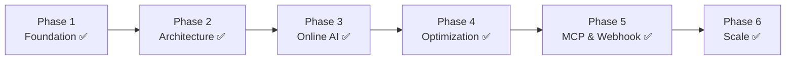

# AI Roadmap — Artificial Intelligence Gateway

> **Original source:** `AI-roadmap.drawio` — converted from Draw.io to structured plan
> **Last updated:** 2026-07-01 — All 6 phases complete ✅

## Vision Statement
Build a comprehensive AI Gateway and Agent Orchestration platform that serves as the **single entry point** for all AI interactions across the organization — managing providers, agents, workflows, costs, and governance.

## Six-Phase Implementation Plan

### Phase 1 — Foundation ✅
**Goal:** Establish the AI Gateway with core capabilities.

| Deliverable | Description | Status |
|-------------|-------------|--------|
| AI Gateway | API entry point for all AI requests | ✅ |
| Agent/Bot Creation | SDK for defining agents declaratively | ✅ |
| Token Consumption | Metering and tracking per-request tokens | ✅ |
| AI Credential Management | Vault for API keys, provider auth (envelope encryption) | ✅ |
| AI Workflow Integration | Basic workflow engine for chaining AI calls | ✅ |

### Phase 2 — Architecture ✅
**Goal:** Finalize overall system architecture with the AI team.

| Deliverable | Description | Status |
|-------------|-------------|--------|
| Architecture Blueprint | Complete system design document | ✅ |
| Team Alignment | Role assignments: Developer, QA, BA/SA | ✅ |
| Technology Decisions | .NET 10, Semantic Kernel, Aspire finalized | ✅ |
| Infrastructure Design | Docker Compose, PostgreSQL, Redis | ✅ |

### Phase 3 — Online AI Integration ✅
**Goal:** Connect to external AI providers.

| Provider | Integration Type | Priority | Status |
|----------|-----------------|----------|--------|
| **OpenCode** | Internal AI Gateway API | **P0** | ✅ |
| **OpenAI** | Direct API (GPT-4o, o-series) | P1 | ✅ |
| **Google Gemini** | Vertex AI / REST API | P1 | ✅ |
| **Anthropic** | Claude API (Sonnet, Opus) | P1 | ✅ |
| **Ollama** | Local open-source models | P2 | ✅ |
| **DeepSeek** | Direct API | P1 | ✅ |
| **Groq** | OpenAI-compatible | P2 | ✅ |
| **OpenRouter** | OpenAI-compatible | P2 | ✅ |
| **Qwen** | OpenAI-compatible | P2 | ✅ |
| **GLM** | OpenAI-compatible | P2 | ✅ |
| **Cloudflare** | OpenAI-compatible | P2 | ✅ |

### Phase 4 — Optimization ✅
**Goal:** Optimize token consumption and cost.

| Feature | Description | Status |
|---------|-------------|--------|
| Token Budgeting | Per-user/project token allocation | ✅ |
| Cost Tracking | Real-time cost accumulation per model | ✅ |
| Model Routing | Intelligent selection: cheapest adequate model | ✅ |
| Caching | Response caching (in-memory + semantic Qdrant) | ✅ |
| Rate Limiting | Per-key and per-provider rate controls | ✅ |
| Multi-Tenancy | Tenant-scoped data isolation | ✅ |
| Pricing Plans | Free/Pro/Enterprise tiers | ✅ |
| Budget Enforcement | Per-tenant token caps | ✅ |
| RBAC | Admin/User/Portal roles | ✅ |
| Compliance Templates | GDPR, PII, Audit, Indonesia PII | ✅ |

### Phase 5 — MCP & Webhook ✅
**Goal:** Support the Model Context Protocol (MCP) and external integrations.

| Feature | Description | Status |
|---------|-------------|--------|
| MCP Server | Expose platform capabilities via MCP | ✅ |
| MCP Client | Consume external MCP servers | ✅ |
| Webhook Engine | Event-driven hooks for workflow triggers | ✅ |
| Event Dispatcher | Background queue with retry + idempotency | ✅ |

### Phase 6 — Scale ✅
**Goal:** Full multi-agent orchestration and AI economy readiness.

| Feature | Description | Status |
|---------|-------------|--------|
| Multi-Agent Fleets | Coordinated agent teams | ✅ |
| Orchestration Engine | Complex multi-step workflows | ✅ |
| AI-to-AI Transactions | Agents calling agents with accounting | ✅ |
| SLA Monitoring | Latency percentiles, error rates, uptime | ✅ |
| Performance Benchmarks | Provider/model health tracking | ✅ |
