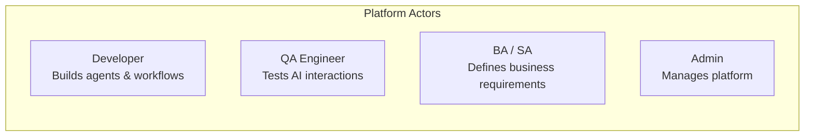

# User Roles & Personas

| Role | Responsibilities | Access Level |
|------|-----------------|--------------|
| **Developer** | Create agents, integrate APIs, build workflows | Write to agents/workflows |
| **QA Engineer** | Test AI responses, validate routing, benchmark models | Read all, test environments |
| **BA / SA** | Define business logic, document requirements | Read reports, write specs |
| **Platform Admin** | Manage users, quotas, providers, billing | Full admin |
| **End User** | Consume AI via approved interfaces | API key, limited scope |
