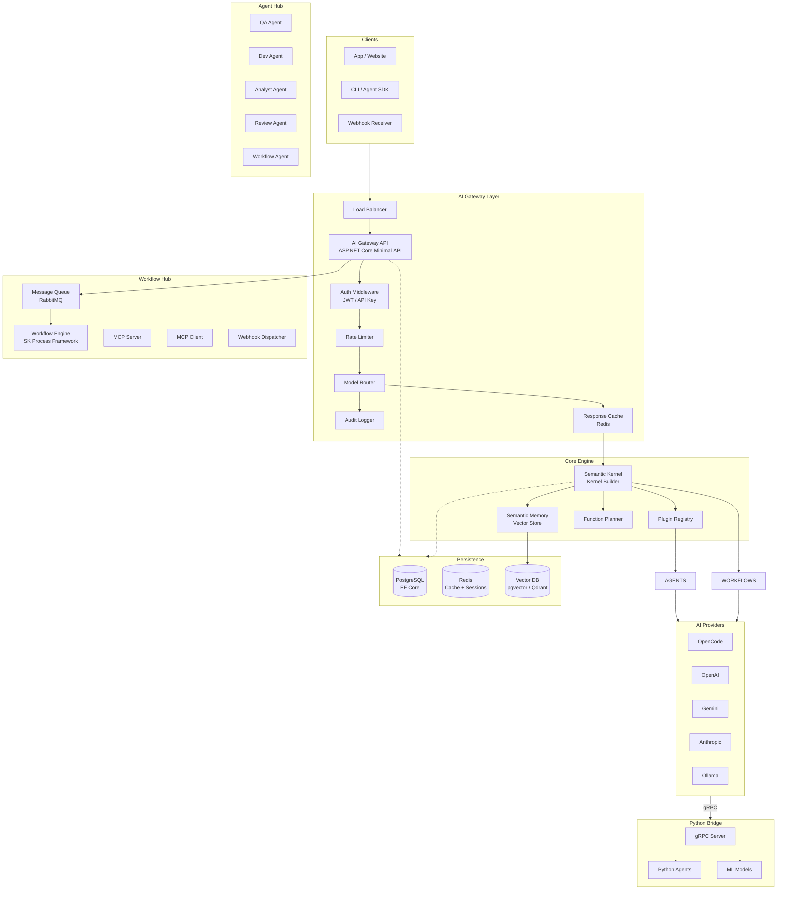

# System Architecture

## High-Level Architecture

## Request Flow

1. **Client** sends request with API key / JWT
2. **Gateway** authenticates & authorizes
3. **Rate Limiter** checks quota
4. **Model Router** selects optimal model/provider
5. **Cache** checks for cached response
6. **Semantic Kernel** processes with plugins
7. **Agent/Workflow** executes business logic
8. **Response** returned with telemetry
