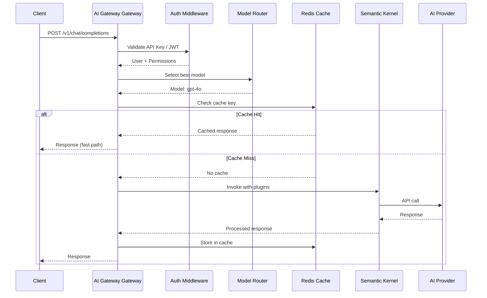

# Component Design

## Gateway API (Arkana.Gateway.Api)

ASP.NET Core Minimal API with the following endpoint groups:

| Group | Endpoints | Description |
|-------|-----------|-------------|
| `POST /v1/chat/completions` | OpenAI-compatible | Unified chat completion |
| `POST /v1/agents/{id}/invoke` | Agent invocation | Run an agent |
| `POST /v1/workflows/{id}/execute` | Workflow execution | Run a workflow |
| `GET /v1/tokens/usage` | Token tracking | Usage statistics |
| `GET /v1/admin/**` | Admin | Dashboard APIs |

## Semantic Kernel Integration

```csharp
// Kernel builder pattern
var builder = Kernel.CreateBuilder()
    .AddOpenAIChatCompletion("gpt-4o", apiKey)
    .AddGoogleGeminiChatCompletion("gemini-2.5-pro", apiKey)
    .AddPluginFromType<MyAgentPlugin>();

builder.Services.AddSingleton<ITokenTracker, TokenTracker>();
builder.Services.AddSingleton<ICostCalculator, CostCalculator>();

var kernel = builder.Build();
```

## Agent Definition (Declarative)

```csharp
[Agent("qa-agent", "QA validation agent")]
public class QaAgent
{
    [KernelFunction("validate_response")]
    [Description("Validates an AI response against criteria")]
    public async Task<string> ValidateResponse(
        string response,
        string criteria,
        IKernelFunction metadata)
    {
        // Agent logic
    }
}
```

## Data Flow: Chat Completion Request


