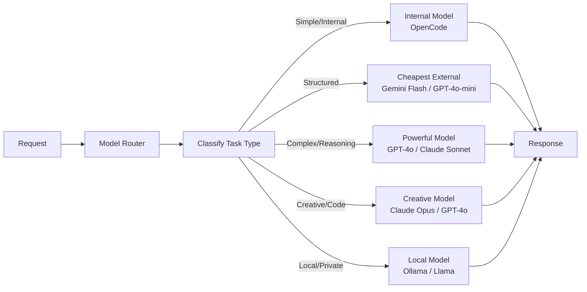

# Phase 4 — Optimization

## Goal
Optimize token consumption, cost, and performance.

## Model Routing Strategy

## Cost Optimization Features

| Feature | Description | Est. Savings |
|---------|-------------|:------------:|
| **Model Routing** | Route to cheapest adequate model | 20-30% |
| **Response Caching** | Cache identical requests | 15-25% |
| **Prompt Compression** | Reduce prompt size via summarization | 10-20% |
| **Token Budgeting** | Per-user/project token caps | Prevents runaway costs |
| **Batch Processing** | Batch similar requests | 5-10% |

## Tasks

- [ ] Implement model routing engine (cost/quality optimization)
- [ ] Response cache (Redis, with TTL and invalidation)
- [ ] Real-time cost tracking middleware
- [ ] Per-user/project token budgets
- [ ] Rate limiting (sliding window, token bucket)
- [ ] Admin API for cost reports
- [ ] Usage projections and anomaly detection
