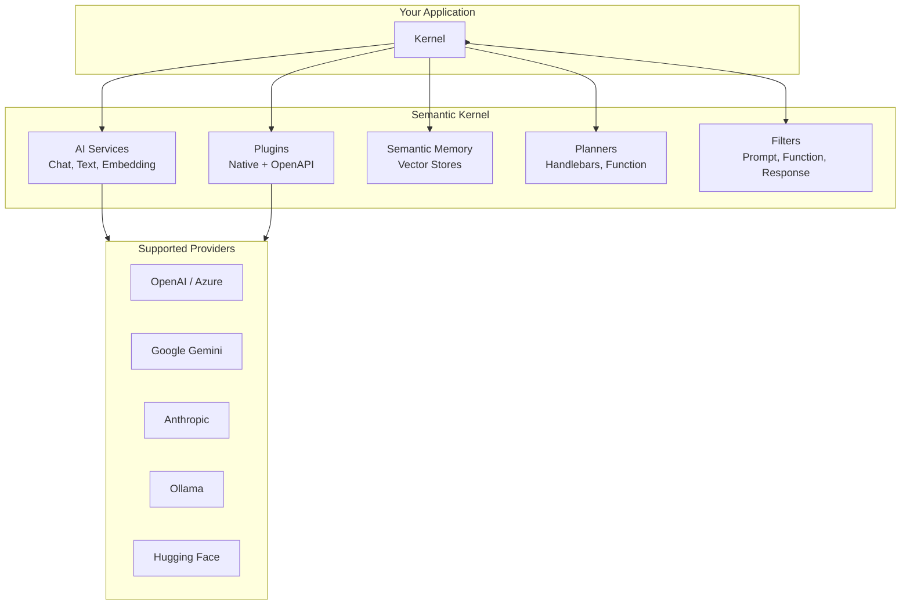

# Semantic Kernel — Deep Dive for AI Gateway

## Architecture Overview



## Key Concepts

### Kernel — The Central Orchestrator
Connects AI services, plugins, and memory into a single pipeline.

```csharp
var kernel = Kernel.CreateBuilder()
    .AddOpenAIChatCompletion("gpt-4o", key)
    .AddGoogleGeminiChatCompletion("gemini-2.5-pro", key)
    .AddPluginFromType<TimePlugin>()
    .AddPluginFromType<WeatherPlugin>()
    .Build();

// Invoke with auto function calling
var result = await kernel.InvokePromptAsync(
    "What's the weather in {{$city}}?",
    new() { ["city"] = "Jakarta" });
```

### Plugins — Extend AI Capabilities
Expose C# methods to AI models via automatic function calling.

```csharp
public class DatabaseQueryPlugin
{
    [KernelFunction("query_database")]
    [Description("Execute a SQL query and return results")]
    public async Task<string> QueryDatabase(
        [Description("SQL query string")] string query)
    {
        // Execute safely with read-only guard
    }
}
```

### Agent Framework — Multi-Agent Coordination

| Component | Purpose |
|-----------|---------|
| **ChatCompletionAgent** | Single agent with system prompt + plugins |
| **AgentGroupChat** | Multi-agent chat with turn management |
| **TerminationStrategy** | Define when multi-agent conversation ends |
| **SelectionStrategy** | Decide which agent speaks next |

```csharp
// Multi-agent setup
var qaAgent = new ChatCompletionAgent(qaKernel, "QA-Agent");
var devAgent = new ChatCompletionAgent(devKernel, "Dev-Agent");

var chat = new AgentGroupChat(qaAgent, devAgent)
{
    ExecutionSettings = new()
    {
        SelectionStrategy = new SequentialSelectionStrategy(),
        TerminationStrategy = new MaxTurnTerminationStrategy(10)
    }
};
```

### Process Framework — Stateful Workflows

```csharp
// Define process steps
public class PrepareDatasetStep : KernelProcessStep
{
    [KernelFunction]
    public async Task PrepareAsync(KernelProcessStepContext context, string input)
    {
        // Process logic
        await context.EmitEventAsync("DatasetReady", processedData);
    }
}

// Build process
var process = new ProcessBuilder("AIPipeline");
var prepare = process.AddStep<PrepareDatasetStep>();
var analyze = process.AddStep<AnalyzeStep>();

prepare.OnEvent("DatasetReady").SendEventTo(analyze);
```

### Filter System — Cross-Cutting Concerns
Intercept every AI call for audit, cost tracking, and safety:

```csharp
kernel.AutoFunctionInvocationFilters.Add(new CostTrackingFilter());

public class CostTrackingFilter : IAutoFunctionInvocationFilter
{
    public async Task OnAutoFunctionInvocationAsync(
        AutoFunctionInvocationContext context,
        Func<AutoFunctionInvocationContext, Task> next)
    {
        var startTokens = await GetUsedTokensAsync();
        await next(context);
        var endTokens = await GetUsedTokensAsync();
        _costTracker.RecordUsage(context.Function.Name, endTokens - startTokens);
    }
}
```

## AI Gateway Integration Mapping

| AI Gateway Component | SK Feature | How They Map |
|-------------------|-----------|-------------|
| Agent Hub (5 agents) | Agent Framework | Each agent = ChatCompletionAgent + plugins |
| Workflow Hub | Process Framework | Business automation = SK Process steps |
| Plugin Registry | Plugin system | C# agent actions = KernelFunction plugins |
| Model Router | AI Service selector | Multiple IChatClient instances, router picks |
| Token Tracking | AutoFunctionInvocationFilter | Intercept and record token usage |
| Audit Logging | PromptRenderFilter | Capture all prompts sent to AI |
| Memory/RAG | Semantic Memory | Vector store for knowledge base queries |
