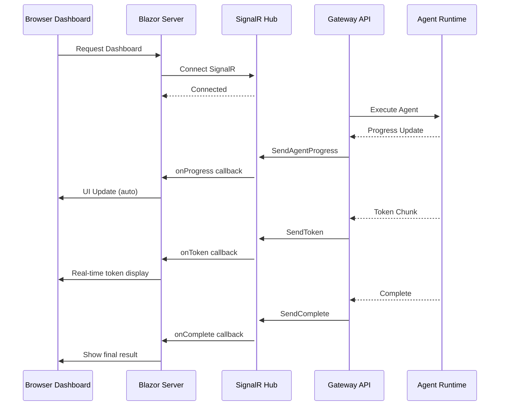

# Real-Time & Admin UI

## SignalR for Real-Time Streaming

Agent execution and AI responses stream in real-time to connected clients:

```csharp
// Hub for agent progress streaming
public class AgentHub : Hub
{
    public async Task ExecuteAgent(string agentId, string input)
    {
        var progress = await _agentService.ExecuteAsync(agentId, input,
            onToken: token => Clients.Caller.SendAsync("onToken", token),
            onProgress: msg => Clients.Caller.SendAsync("onProgress", msg));

        await Clients.Caller.SendAsync("onComplete", progress);
    }
}
```

## Blazor Server Admin Dashboard

Built with **MudBlazor** for professional UI components:

```csharp
@page "/dashboard"
@inject NavigationManager Navigation
@implements IAsyncDisposable

<MudContainer MaxWidth="MaxWidth.ExtraExtraLarge">
    <MudGrid>
        <MudItem xs="12" md="3">
            <MudPaper Class="pa-4">
                <MudText Typo="Typo.subtitle2">Total Requests</MudText>
                <MudText Typo="Typo.h4">@stats.TotalRequests.ToString("N0")</MudText>
            </MudPaper>
        </MudItem>
        <MudItem xs="12" md="3">
            <MudPaper Class="pa-4">
                <MudText Typo="Typo.subtitle2">Tokens Used</MudText>
                <MudText Typo="Typo.h4">@stats.TotalTokens.ToString("N0")</MudText>
            </MudPaper>
        </MudItem>
        <MudItem xs="12" md="3">
            <MudPaper Class="pa-4">
                <MudText Typo="Typo.subtitle2">Total Cost</MudText>
                <MudText Typo="Typo.h4">@stats.TotalCost.ToString("C4")</MudText>
            </MudPaper>
        </MudItem>
        <MudItem xs="12" md="3">
            <MudPaper Class="pa-4">
                <MudText Typo="Typo.subtitle2">Active Agents</MudText>
                <MudText Typo="Typo.h4">@stats.ActiveAgents</MudText>
            </MudPaper>
        </MudItem>
    </MudGrid>

    <MudTable Items="@usageData" Hover="true" Striped="true">
        <HeaderContent>
            <MudTh>Provider</MudTh>
            <MudTh>Model</MudTh>
            <MudTh>Tokens</MudTh>
            <MudTh>Cost ($)</MudTh>
        </HeaderContent>
        <RowTemplate>
            <MudTd>@context.Provider</MudTd>
            <MudTd>@context.Model</MudTd>
            <MudTd>@context.Tokens.ToString("N0")</MudTd>
            <MudTd>@context.Cost.ToString("C4")</MudTd>
        </RowTemplate>
    </MudTable>
</MudContainer>

@code {
    private HubConnection hubConnection;
    private DashboardStats stats = new();
    private List<UsageRecord> usageData = new();

    protected override async Task OnInitializedAsync()
    {
        hubConnection = new HubConnectionBuilder()
            .WithUrl(Navigation.ToAbsoluteUri("/hubs/dashboard"))
            .WithAutomaticReconnect()
            .Build();

        hubConnection.On<UsageRecord>("UsageUpdate", record =>
        {
            usageData.Add(record);
            StateHasChanged();
        });

        await hubConnection.StartAsync();
        await LoadInitialStats();
    }
}
```

## Real-Time Data Flow



## MudBlazor Components Used

| Component | Use Case |
|-----------|----------|
| MudTable | Agent list, usage history, audit log |
| MudChart | Token usage trends, cost over time |
| MudCard | Dashboard stat cards |
| MudDialog | Agent configuration, confirmations |
| MudSnackbar | Notifications for events |
| MudTextField | API key input, prompt editing |
| MudSelect | Provider/model selection |
| MudProgressLinear | Agent execution progress |
