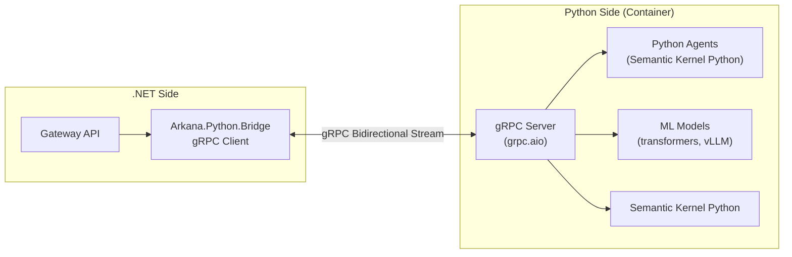

# Python Integration Strategy

## Why Python in a .NET Project?

AI Gateway is primarily C# (.NET), but Python is essential for:

1. **ML/AI Heavy-Lifting** — Python has richer ML ecosystem (transformers, vLLM, LangChain)
2. **Data Science Workflows** — Pandas, NumPy, scikit-learn for token analytics
3. **Semantic Kernel Python** — SK runs natively in Python, same patterns as C#
4. **MCP Ecosystem** — Many MCP servers are Python-native
5. **Agent Diversity** — Some agents benefit from Python's dynamic nature

## Integration Architecture



## gRPC Contract (Protobuf)

```protobuf
syntax = "proto3";

service ArkanaPythonBridge {
    // Execute a Python agent (streaming)
    rpc ExecuteAgent (AgentRequest) returns (stream AgentResponse);

    // Run ML inference
    rpc RunInference (InferenceRequest) returns (InferenceResponse);

    // Health check
    rpc Ping (Empty) returns (HealthStatus);
}

message AgentRequest {
    string agent_id = 1;
    string input = 2;
    map<string, string> parameters = 3;
    string session_id = 4;
}

message AgentResponse {
    oneof response_type {
        string token = 1;        // Streaming token
        string progress = 2;     // Progress update
        string error = 3;        // Error message
        string result = 4;       // Final result
    }
}
```

## Implementation

### Python gRPC Server

```python
import asyncio
import grpc
from grpc import aio
from semantic_kernel import Kernel

import arkana_bridge_pb2 as pb2
import arkana_bridge_pb2_grpc as pb2_grpc


class ArkanaBridgeServicer(pb2_grpc.ArkanaPythonBridgeServicer):
    """Bridge between .NET AI Gateway and Python agents/ML."""

    def __init__(self):
        self.kernels = {}  # cache kernels by config

    async def ExecuteAgent(self, request: pb2.AgentRequest,
                          context: aio.ServicerContext):
        """Execute a Python agent with streaming response."""
        try:
            kernel = await self._get_or_create_kernel(request.agent_id)

            # Stream progress updates
            yield pb2.AgentResponse(progress=f"Starting agent: {request.agent_id}")

            # Execute agent with Semantic Kernel
            async for token in self._run_agent(kernel, request):
                yield pb2.AgentResponse(token=token)

            yield pb2.AgentResponse(result="Agent completed successfully")

        except Exception as e:
            yield pb2.AgentResponse(error=str(e))

    async def RunInference(self, request: pb2.InferenceRequest,
                          context: aio.ServicerContext):
        """Run ML model inference."""
        # Use transformers or custom model
        result = await self._model_inference(request.model_name, request.input)
        return pb2.InferenceResponse(
            output=result["output"],
            confidence=result["confidence"],
            latency_ms=result["latency_ms"]
        )

    async def Ping(self, request: pb2.Empty,
                   context: aio.ServicerContext):
        return pb2.HealthStatus(status="healthy", version="1.0.0")


async def serve():
    server = aio.server()
    pb2_grpc.add_ArkanaPythonBridgeServicer_to_server(
        ArkanaBridgeServicer(), server)
    server.add_insecure_port("[::]:50051")
    await server.start()
    await server.wait_for_termination()


if __name__ == "__main__":
    asyncio.run(serve())
```

### .NET gRPC Client

```csharp
// Arkana.Python.Bridge/GrpcPythonBridge.cs
public class GrpcPythonBridge : IPythonBridge, IDisposable
{
    private readonly GrpcChannel _channel;
    private readonly ArkanaPythonBridgeClient _client;
    private readonly ILogger<GrpcPythonBridge> _logger;

    public GrpcPythonBridge(string address, ILogger<GrpcPythonBridge> logger)
    {
        _channel = GrpcChannel.ForAddress(address);
        _client = new ArkanaPythonBridgeClient(_channel);
        _logger = logger;
    }

    public async IAsyncEnumerable<string> ExecuteAgentAsync(
        string agentId, string input,
        Dictionary<string, string>? parameters = null,
        [EnumeratorCancellation] CancellationToken ct = default)
    {
        var request = new AgentRequest
        {
            AgentId = agentId,
            Input = input,
        };
        if (parameters is not null)
            request.Parameters.Add(parameters);

        using var streaming = _client.ExecuteAgent(request,
            deadline: DateTime.UtcNow.AddMinutes(5),
            cancellationToken: ct);

        await foreach (var response in streaming.ResponseStream.ReadAllAsync(ct))
        {
            switch (response.ResponseTypeCase)
            {
                case AgentResponse.ResponseTypeOneofCase.Token:
                    yield return response.Token;
                    break;
                case AgentResponse.ResponseTypeOneofCase.Progress:
                    _logger.LogInformation("[{Agent}] {Progress}", agentId, response.Progress);
                    break;
                case AgentResponse.ResponseTypeOneofCase.Error:
                    throw new PythonBridgeException(response.Error);
                case AgentResponse.ResponseTypeOneofCase.Result:
                    _logger.LogInformation("[{Agent}] Complete", agentId);
                    break;
            }
        }
    }

    public void Dispose() => _channel?.Dispose();
}
```

## Decision Matrix

| Option | Latency | Streaming | Complexity | Security | Verdict |
|--------|---------|-----------|------------|----------|---------|
| **gRPC Bridge** | ★★★★★ | ★★★★★ | ★★★☆☆ | ★★★★★ | **Selected** |
| Python.NET (pythonnet) | ★★★★☆ | ★★★☆☆ | ★☆☆☆☆ | ★★☆☆☆ | Dev/prototyping only |
| Process Bridge (sidecar) | ★★☆☆☆ | ★☆☆☆☆ | ★★★★★ | ★★★☆☆ | Migration only |
| REST API | ★★★☆☆ | ★★☆☆☆ | ★★★★★ | ★★★★☆ | External services only |

## Python Project Structure

```
src-python/
├── arkana_bridge/           # gRPC server
│   ├── __init__.py
│   ├── server.py              # gRPC server entry point
│   ├── servicer.py            # Bridge service implementation
│   └── proto/                 # Generated protobuf code
│       ├── arkana_bridge_pb2.py
│       └── arkana_bridge_pb2_grpc.py
├── arkana_agents/           # Agent implementations
│   ├── __init__.py
│   ├── base_agent.py          # Abstract base agent
│   ├── qa_agent.py            # QA validation agent
│   ├── analyst_agent.py       # Data analysis agent
│   └── review_agent.py        # Code review agent
├── arkana_ml/               # ML model serving
│   ├── __init__.py
│   ├── inference.py           # Model inference wrapper
│   └── models/                # Model definitions
├── arkana_sk/               # Semantic Kernel Python extensions
│   ├── __init__.py
│   └── plugins/               # Python native plugins
├── requirements.txt
├── Dockerfile
└── pyproject.toml
```

## Python Dependencies

```
# requirements.txt
grpcio>=1.62
grpcio-tools>=1.62
semantic-kernel>=1.15
numpy>=1.26
pandas>=2.2
transformers>=4.40
httpx>=0.27
pydantic>=2.7
opentelemetry-api>=1.25
opentelemetry-sdk>=1.25
```

## Container Setup (Docker)

```dockerfile
FROM python:3.12-slim

WORKDIR /app

# Install dependencies
COPY requirements.txt .
RUN pip install --no-cache-dir -r requirements.txt

# Copy source
COPY src-python/ .

# Expose gRPC port
EXPOSE 50051

# Run gRPC server
CMD ["python", "-m", "arkana_bridge.server"]
```
